## ENSE 370 - Software Systems Design - Laboratory

# Lab 2: Introduction to UML

### University of Regina
### Faculty of Engineering and Applied Science - Software Systems Engineering

### Lab Instructor: [Adam Tilson](mailto:Adam.Tilson@uregina.ca)

---

<!-- TOC -->

- [Introduction](#introduction)
- [Use Case Diagram](#use-case-diagram)
- [Sequence Diagram and Communication Diagrams](#sequence-diagram-and-communication-diagrams)
- [Class Diagram](#class-diagram)        
    - [Attributes](#attributes)
    - [Operations](#operations)        
    - [Relationships](#relationships)        
    - [Inheritance](#inheritance)        
    - [Interface](#interface)        
    - [Aggregation and Composition](#aggregation-and-composition)        
    - [Dependency](#dependency)    
- [Drawing UML Diagrams with UMLET](#drawing-uml-diagrams-with-umlet)    
- [Assignment](#assignment)    
- [Submission](#submission)    
- [References](#references)
<!-- /TOC -->

## Introduction

Software Design is commonly communicated through the Unified Modeling Language (UML), a graphical documentation tool, especially those built on Object Oriented Programming principles. UML was created to standardize competing modeling conventions, and thus occasionally has some confusing or ambiguous structures. The purpose of this lab is to introduce you to a few major types of UML diagrams.

UML Diagrams are broken down into two major categories, structural and behavioural. Structural model the structure of software (e.g. components, objects, classes), and behavioural model the behaviour (e.g. activity, state and interactions).

The purpose of UML is to communicate designs between team members. In Agile development it is inappropriate to do a massive UML design first, then get to coding later - instead many smaller iterative designs should be used through the lifecycle of the project, with modeling and coding phases.

By working in UML we abstract away the data, forcing us to think design first, not implementation.

Guiding Principles of Modeling Diagrams
- The goal is to make it easier to communicate designs to your team
- Standards are useful until they become too limiting
    - if your team agrees to deviate from the standard for a good reason, that's fine, but have some way of communicating those deviations to me / new team members / whoever
- Don't use all the diagrams just for the sake of using them - be conscious about what you use and what you don't use!
- If the best way to communicate your design is through code, then use code!

In this lab we'll look at four types of UML diagrams: Use Case, Sequence, Communication and Class diagrams.  We will use the example of a user purchasing soda from a vending machine.

---

## Use Case Diagram

Use cases capture the functional requirements for a system by describing typical interactions between the user and the system.

Users are referred to as `Actors`, and are typically drawn as stick people. Actors represent roles, in reality one user may represent multiple actors. Actors can also be non-human, e.g. if a system performs a service for another system, it could be represented as an actor.

Use Cases represent a list of steps which are followed to complete the task, and may include success scenarios, and extensions. 

An example use case for the Vending Machine:

---
### Buy a Soda

Main Success Scenario:
1. Customer browses available products
2. Customer inserts money into vending machine
3. System acknowledges the correct amount of money
4. User presses the button corresponding to the desired product
5. System dispenses the product

Extensions:

- 3a: Machine fails to read the money deposited
    - .1 Refund the money to the user

---

We can represent this graphically:

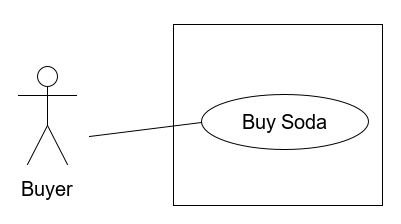

For such a trivial system, this diagram seems silly. Let's expand our scope to include the ability for maintenance people to refill stock:

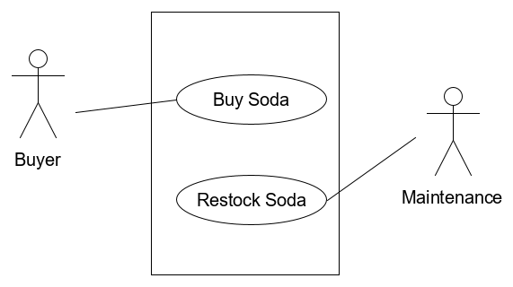

If use cases reuse a certain part of logic, these can be included. For example, if the vending machine issued both soda and food, we could include a common use case where the user deposits money:

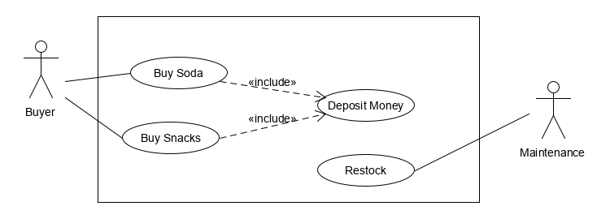

Here is the same diagram annotated to document elements, using UML comments:

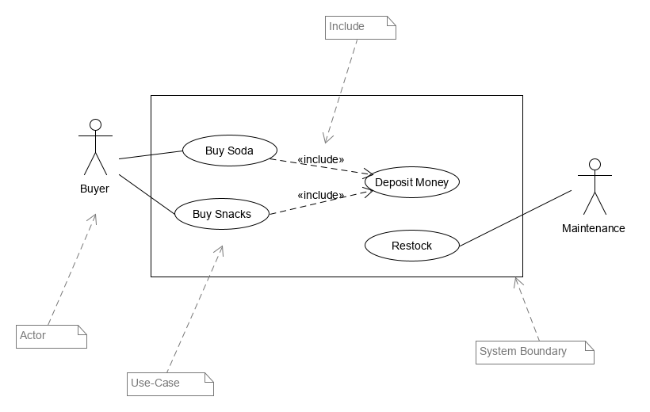

---

## Sequence Diagram and Communication Diagrams

A sequence diagram is an interaction diagram which captures the behavior of a single scenario. The diagram shows objects, the span of time in which they are active, and the order in which messages pass between them.

Terminology:

`Lifeline` - a vertical dashed line for each object 

`Activation bar` - a solid bar which shows when a participant is active in the interaction. Typically this indicates a function is on the stack. You can have multiple functions on the stack by stacking multiple bars, called `nested activations`

`Message` - data which is being passed between objects, typically implemented as a function call. Represented by some form of horizontal arrow

`Found message` - a message from outside of the system which instigates behavior

`Synchronous messages` - a message which awaits a return, and are represented by a closed arrowhead

`Asynchronous messages` - do not await a return, instead start a new process, represented by an open or half arrowhead

`Return statements` - represented by dashed arrows

`Participants` - the various components which are interacting in the system. As they do not need to strictly map to objects or classes, the term participants is used.

Consider a vending machine modified slightly so that the user must now perform the following actions:
1. The user selects a product from the display 
2. The price is computed and displayed to the user
3. The user deposits change into the machine
4. The user confirms the product to purchase
5. The vending machine confirms enough change was deposited
6. The machine dispenses the product
7. The machine dispenses any change 

We can represent this in the following sequence diagram:

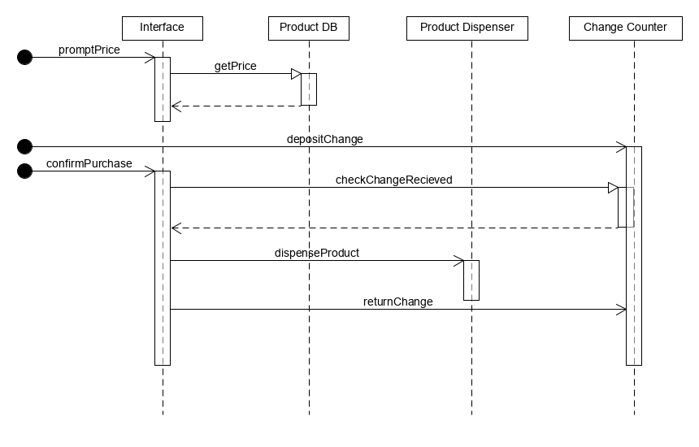

Note that this is a simplified explanation of sequence diagrams. There are many more elaborate components you can see and make use of, such as loops, optional sections and guards.

A communication diagram serves a similar purpose, but is laid out entirely differently. 

Here is the same diagram annotated to document elements:

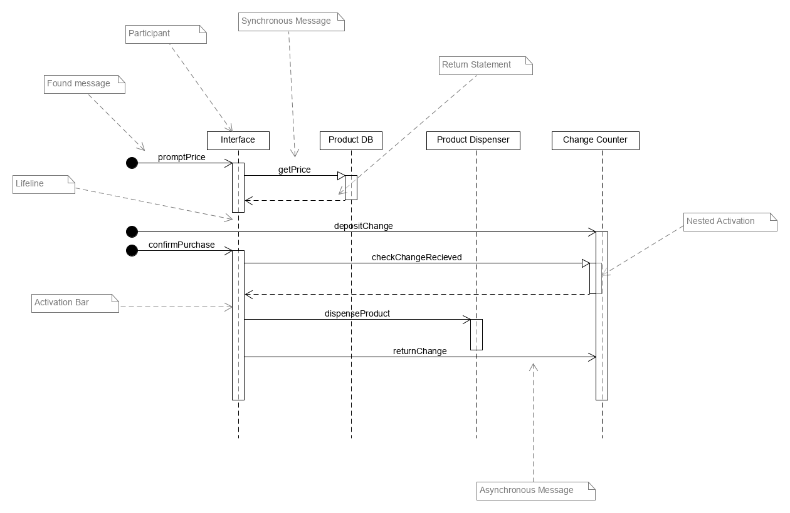

The same procedure is displayed in the following Communication diagram.

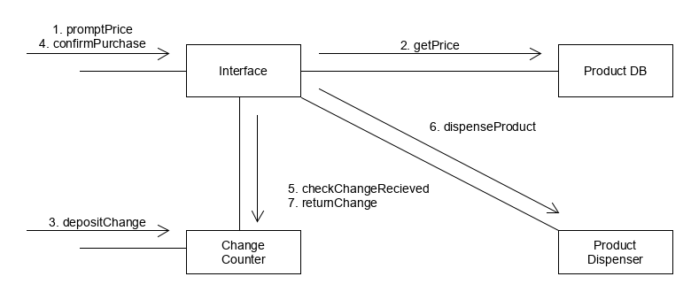

These diagrams capture much of the same information, and typically over time software developers gain preference for one model over the other.

---

## Class Diagram

"If someone were to come up to you in a dark alley and says, "Psst, wanna see a
UML diagram?" that diagram would probably be a class diagram." M. Fowler. UML Distilled.

---

Class diagrams are a very important part of UML, as they represent the concrete building blocks of object-oriented programming, and are heavily used to document software design, such as design patterns.

When designing, class diagrams should be done last, as they represent implementation details rather than abstractions. Before starting to draw class diagrams, you should already know your participants, messages and behaviours. Only then start thinking about data.

There are two major aspects of class diagrams, documenting a class, and explaining relationships between classes. Typically these relationships will have some expression in the code that implements the class, like through references or superclasses, but not always. As with sequence diagrams, class diagrams are quite extensive, so we will primarily focus on the core features.

A single class is represented by a box separated into three compartments. These compartments represent:
- `Name`
- `Attributes`
- `Operations`

Additionally, arrows to other boxes of the diagram represent `relationships`.

State is represented by both `attributes` and `relationships`. When learning, it can be useful to think of these all as variables in the class, though this is not always the case.

### Attributes

Attributes are described by a line of text in the second compartment of the class with the following syntax:
```
visibility name : type multiplicity = default
```

e.g.
```
- productName : String = "None"
```
`visibility` shows the access modifier, such as public(+), private(-), or protected(#)

`name` represents the approximate name the variable would be given in code

`type` represents the approximate data type which represents the variable in code

`multiplicity` is used to specify the length of aggregate data types, like an array, and is given in square brackets, e.g. [3], [0..5] (zero to five), [*] (zero or more)

`default` represents the fields value if no other value is specified

As with compartments, usage of these parts are optional and may be omitted where it would increase comprehension and clarity.

Here are some examples of different attributes with the corresponding java code:

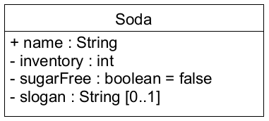

```java
public class Soda {
    public String name;
    private int inventory;
    private boolean sugarFree = false;
    private String [] slogan; // or could do 'null'
}
```

### Operations

Operations are the behaviors of a class, and correspond to the class methods. They are recorded in the third compartment and are written as a single line of text of the form:

```
visibility name (parameters) : return-type
```

e.g.
```
+ sellProduct (Product) : void
```

`visibility` shows the access modifier, such as public(+), private(-), or protected(#)

`name` represents the approximate name the function would be given in code. For a constructor, the name should match that of the class.

`parameters` list the datatypes of the function parameters, separated by commas. You could also use the `name : datatype` format if it clarifies intention.

`return-type` lists the return type. If return type is void, you can leave this blank, or explicitly use the word void. If documenting a constructor, leave this blank.

### Relationships

Relationships are represented by a line between two classes, often with some type of arrowhead or connector. Along the line, you can write in some of the some parts of an attribute, such as name and multiplicity in each direction. 

`Association` - indicated by a solid arrow with an open arrowhead. This means that the first class contains a reference to the second class, thus it can access public variables and functions in the second class.

Here is an example in which an Order can contain one Soda named "product". However, the same product may appear in many Orders...

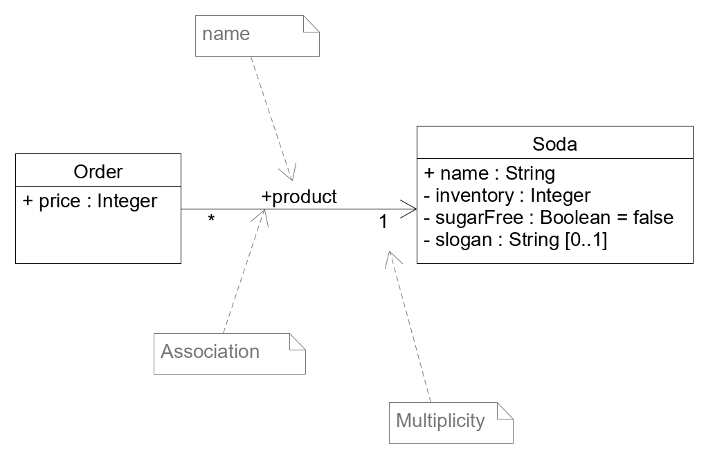

With corresponding Java code.

```java
public class Order {
    public int price;
    public Soda product;
}
```
Arrows can be drawn both ways, which is a `bidirectional association`. In this case, each class would have a reference to the other in code.

### Inheritance

Inheritance is indicated by a closed arrowhead, pointing upwards toward the super class. In some diagrams you will see these lines drawn at an angle, but I prefer the vertical / horizontal corner style.

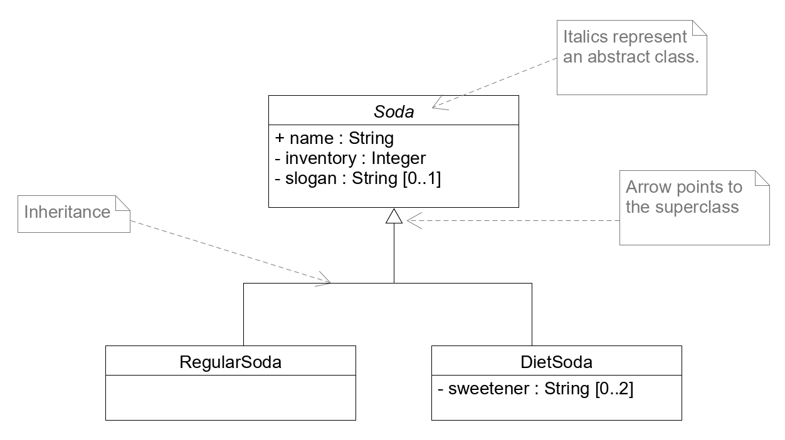

With corresponding Java code...
```java
public abstract class Soda {
    public String name;
    private int inventory;
    private String [] slogan;
}

public class RegularSoda extends Soda {

}

public class DietSoda extends Soda {
    private String [] sweetener;
}
```

Abstract Classes typically have their names italicized in UML.

### Interface

In Java, implementing interfaces is core to the language. The interface implementation has a few documentation standards, such as:

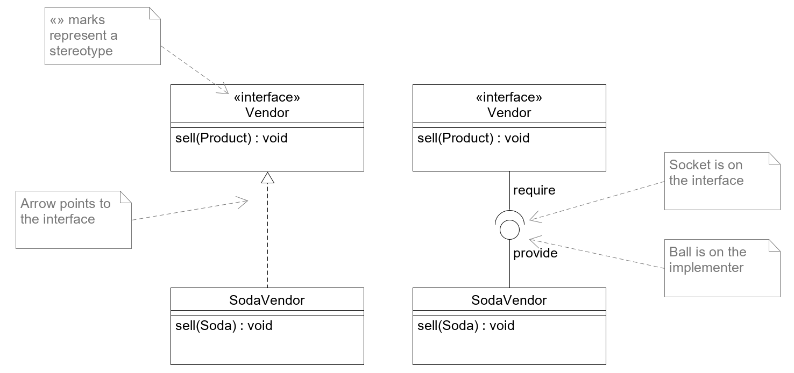

```java
public interface Vendor {
    public void sell();
}

public class SodaVendor implements Vendor {
    public void sell(){
        ...
    }
}
```

The ball and socket style is used to represent required interfaces. It was popularized in M. Fowler's UML Distilled, though he later admitted this notation is not intended by the UML committee. Still, because this is a popular reference, you may see it in practice. 

Interface names are tagged with the `«interface»` stereotype. The « » symbols aren't just double arrows, but a type of punctuation marks in some languages.

### Aggregation and Composition

Aggregation and composition both represent a "whole/part" relationship, and are a common point of confusion in UML. In both cases, the class on the side with the diamond acts a whole, which is made up of a set of parts. The major difference is with persistence: if the whole is destroyed, are the parts destroyed? If yes, this is composition. If not, then this is aggregation. Even worse, in Java code these are typically implemented the same, so UML usage is intended to communicate ideas rather than note a functional difference.

`composition` - An example of composition is if our Soda pop is made up of a set of ingredients. If we drink the pop, we've destroyed the ingredients, so this is a composition relationship.

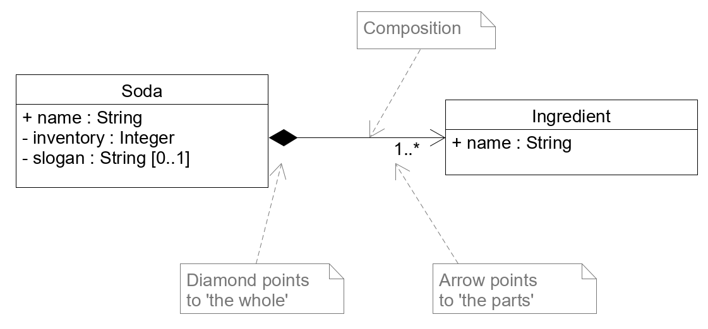

```java
public class Ingredient {
    public String name;
}

public class Soda {
    public String name;
    private int inventory;
    private String [] slogan;
    public Ingredient [] ingredients;
}
```

`aggregation` - An example of aggregation is that of having a list of favorite sodas. If I have a list of favourite sodas, and decide I'm going healthy, so I destroy that list, are the sodas removed? No, they still exist, just no longer considered part of that list. In this sense, aggregation is more abstract than composition.

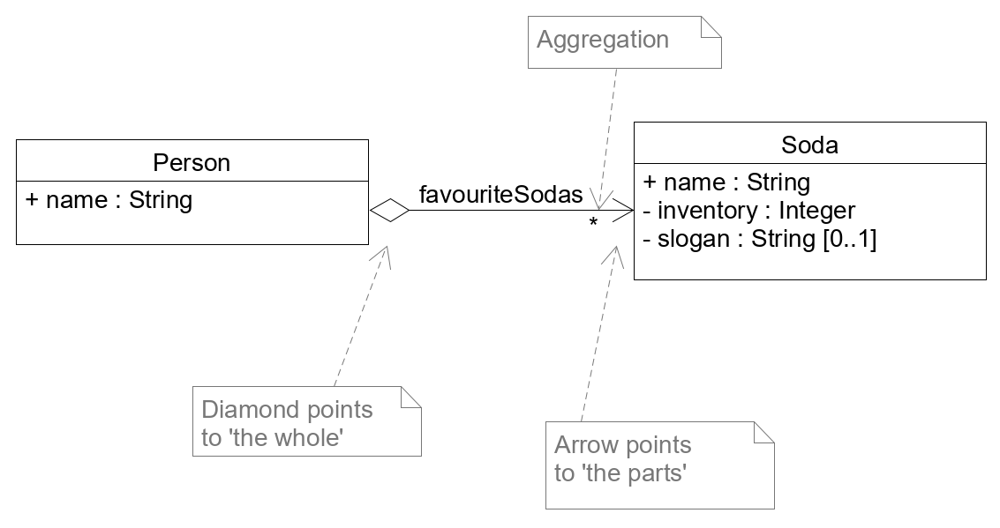
```java
public class Soda {
    public String name;
    private int inventory;
    private String [] slogan;
}

public class Person {
    public String name;
    public Soda [] favouriteSodas;
}
```

Unfortunately in Java, there is no implementation difference between these, because everything is done by references, so there is no way to ensure that if the container class is destroyed, the objects it contain will be destroyed unless we have carefully managed our references. In other languages, we could use a `destructor`.

### Dependency

Another tricky relationship is the dependency, documented with a dashed arrow with an open arrowhead. A dependency exists if changes to one class may effect the other. A common use of this is a class which uses a concrete class, but that concrete class relies on an interface - if the interface changes then the concrete class will change.

Dependencies have no direct implementation in java code. They may be a sign that your code is too tightly coupled.

- e.g. I know about abstract products, but I have concrete products.

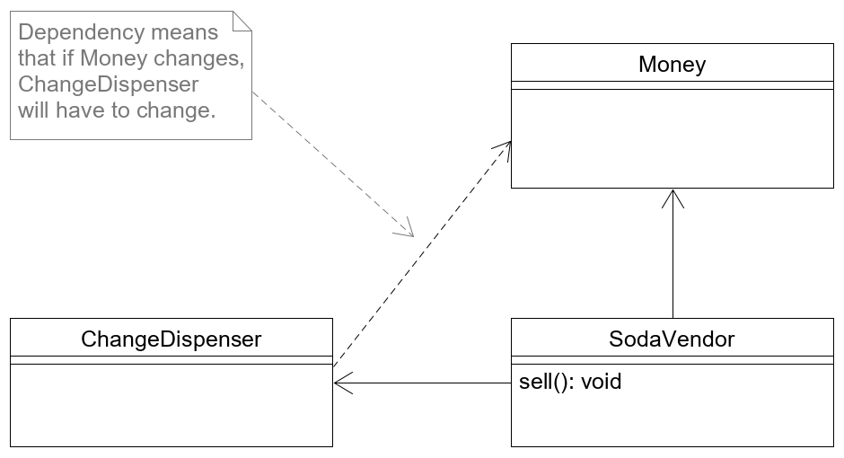

---

## Drawing UML Diagrams with UMLET

UMLET is a Java application for creating quick UML diagram.

[You can download it here as a Java JAR](https://www.umlet.com/changes.htm)

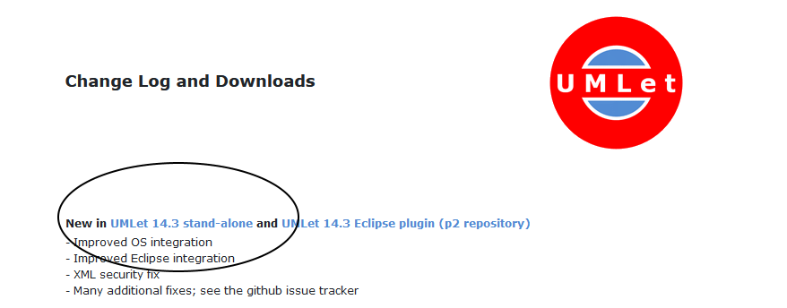

Unzip and run the jar file using the following command:

```
java -jar umlet.jar
```

Leave the console window running, or UML will close.

If you are a Visual Studio Code user, you can check out this [extension](https://marketplace.visualstudio.com/items?itemName=TheUMLetTeam.umlet), and then launch it by creating and opening a blank `.uxf` file.

A quick tour of the UI:

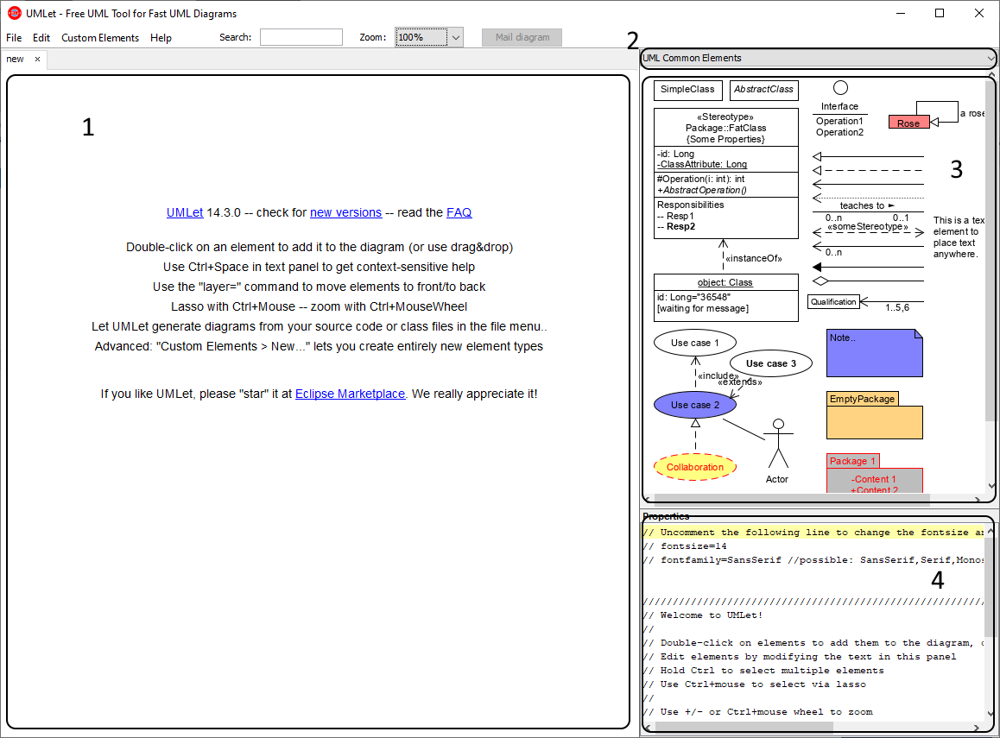

1. Center stage - this is where you will draw your UML diagram. Drag things around, both as a whole or on control points, such as corners of boxes, arrow edges, and the middle of lines to make bends.
2. Palette Filter - Use this drop down to select from different sets of common objects which will appear in the palette (3)
3. Palette - Prefabricated components appear here, filtered based on your selection from (2). You can edit these components directly on the palette. You can add them to the center stage area by double clicking or drag and dropping. You can also modify them here to better suit your needs.
4. Properties - The properties of objects are represented by simple text commands. It's typically easiest to find a component that has the style you want by browsing the drop down at and the tools at 3, and then modifying it to suit your needs. 

When you are happy with your diagram, you can save it as the interal file type (`.uxf`), or export it using File -> Export as... and select `png` or `PDF`.

Common questions:

- I accidentally deleted something I need from my palette!
    - Save your work and restart UMLet and the default palettes will return.

For this lab, you may use any UML creation software which you prefer. You can also draw them by hand.

---

## Assignment

Throughout the lab you have seen snippets of the vending machine in action, with slightly different functionality depending on the example. Now you will do a full design using UML (Use Case Diagram, Sequence and/or Communication, and Class Diagram) for the following two scenarios:

1. User Purchases a Soda

Happy path:

- The user interacts with the Vending Machine User Interface class, which displays available products
- A user may select from three products
- The product price is displayed
- A user may then insert some amount of money
- The user may then attempt to purchase one of the three products
- If enough money was entered and the soda is in stock, 
    - the soda is dispensed
    - Change is returned

One of two exception cases may happen:

- If insufficient money was inserted, the money is refunded, the user is informed the cause of failure

- If a product is out of stock, the money is refunded, the user is informed the cause of failure

The vending machine needs to track both the product inventory and also the change added.

2. A maintainence person restocks the products
- The maintenence person uses a key to switch the machine into maintenence mode
- The maintainenece person then adds products
- The maintainence person also removes change
- One maintainence is complete, the maintence person must manually enter the amount of inventory for each product, and total change left in the machine.

One exception may happen:

- If a product is discontinued, the maintainence person can replace tne product with a new one, 
    - If so, they must also update the price and name for the new product

Your submission should include one use case diagram, one class diagram, and several communication or sequence diagrams. For exception paths, you may draw the sequence or communicaiton diagram just for these steps, to reduce repetition.

---

## Submission

Please submit your assignment using the course submission utility on Snoopy. 

Please export your UML files as an image, e.g. `.png` or `.pdf`.

You may zip your UML files. 

Here is the command for submitting this assignment:
```
~ense370/bin/submit L02 your-file.zip
```
You may check that you have submitted your assignment correctly with the command:
```
~ense370/bin/submit --check
```

---

## References

A. Holub, [Allen Holub's UML Quick Reference](https://holub.com/uml/), 2017.

M. Fowler. UML Distilled: A Brief Guide to the Standard Object Modeling Language. 3rd Ed. Addison Weseley. 2003.

A. Holub, [Picturing Architecture: UML (The Good Bits)](https://app.pluralsight.com/library/courses/picturing-architecture-uml/table-of-contents), Pluralsight, 2016