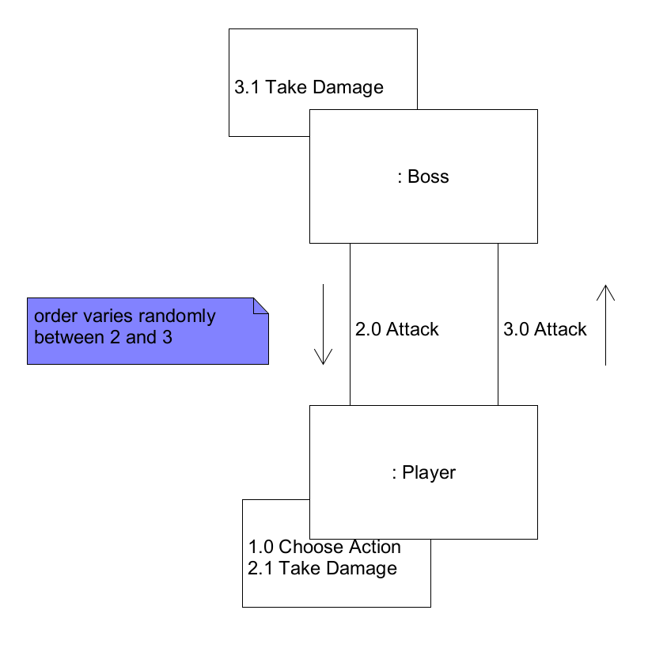
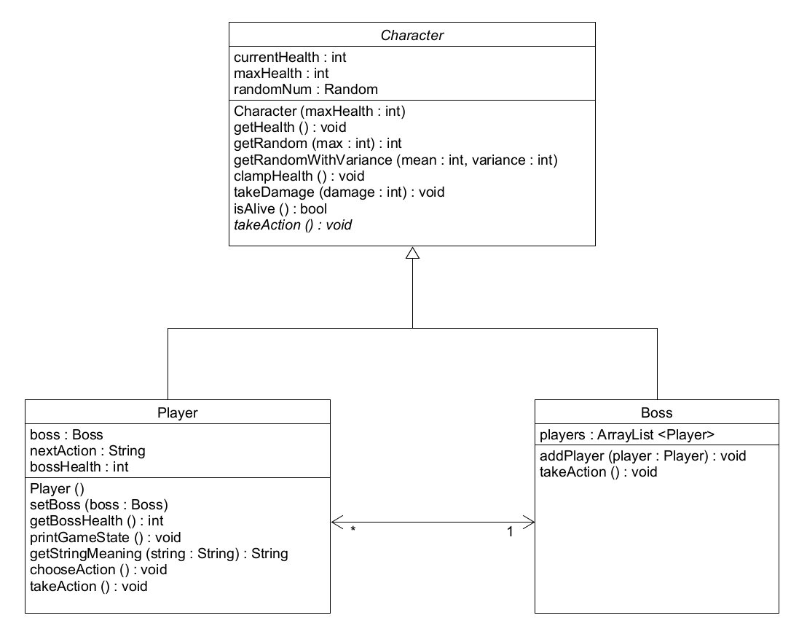
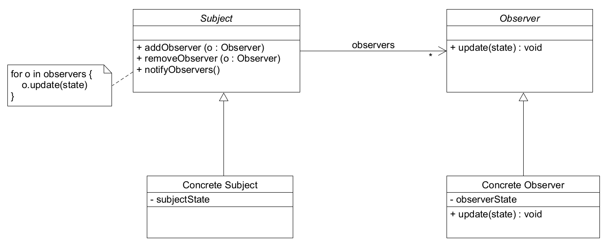

## ENSE 370 - Software Systems Design - Laboratory

# Lab 5: Observer Design Pattern

### University of Regina
### Faculty of Engineering and Applied Science - Software Systems Engineering

### Lab Instructor: [Adam Tilson](mailto:Adam.Tilson@uregina.ca)

---

### Introduction

In the previous labs we looked at implementing chunks of a Role Playing Game using design patterns. We will continue this by looking at a problem which may be encounted in multi-player boss battles, and how it may be solved by using the Observer design pattern. Further, as we are moving towards refactoring, a larger existing codebase will be provided to start you thinking about refactoring.

### Phase 1: Single player boss battle

In this phase, a single player will battle a boss in a series of turns.

The game has the following rules:
- The player has 50 health
- The boss has 100 health
- The player can attack for 10 damage +/- 2, or heal itself for 30 +/- 3.
- The boss can attack the player for 15 damage +/- 5
- Each turn the player gets to see the player's and the boss's health, and decide whether to attack or heal.
- Whether the player or the boss goes first in the turn is selected randomly.
- If the boss's health is decreased to zero, it is defeated.
- If the player's health is decreased to zero, it is game over.

The player and boss are represented by classes, and the overall game is mediated by a `Game` class.

A communications diagram for the situation where both characters attack is shown below:



You can see an example of this in eg-1.

### Problems with our code

We have some repeated code, we could put this in an abstract class for code reuse.

We will extract a `Character` class to include the repeated code.

## Phase 2: Multiplayer with two classes

As always, with playtesting, we get some new requirements for our game.

The second iteration of the game has multiple players in a party fighting the boss. The game is updated to use the following rules:

Initialization:
- Each player has 50 health
- The boss has 100 health times the number of players

Attacking:
- The player can attack for 10 damage +/- 2, or heal itself for 30 +/- 3.
- The boss can attack the player for 15 damage +/- 5
- The boss will attack as many times as there are alive players
- The boss selects a target randomly

Turns:
- Each turn, each player displays the player's and the boss's health, and decides whether to attack or heal.
- All of the orders are issued at the beginning of the round, but then turns are taken in random order, including the players and bosses attacks.

Win / Lose:
- When a player's health drops to zero, they can no longer be healed or act, but should not be removed from the game.
    - If a player is defeated before their action is taken, they lose it
- If the boss's health is decreased to zero, it is defeated and the player party wins.
- If all the player's health is decreased to zero, it is game over.

The following figure shows a class diagram for this state...



Let's look at this version implemented in the `eg-2` filess

## Problems with this phase of code.

Right now in order for any characters to learn the Health of the boss, they need to ask them. If all of the players heal, then the boss has taken no damage, so these were all necessary checks. This is inefficient, if the health hasn't changed we've wasted a function call. Instead, whenever the health of the boss changes, we want to be able to notify all of the interested parties. This is a problem to be solved by: The Observer Pattern!

## The Observer Pattern

In the observer pattern there are two classes: Subjects and Observers. Subjects have the ability to add, remove and notify observers. Notify is called any time something relevant in the observer changes which the observer would want to know. They automatically pass this information on to the observer, to update it's own state.



In this diagram, `state` represents one or more variables which belong to the subject, but need to be known by the observer. It is recorded in both places. It is passed to the observer over the update function. Because the observer implements the update function, it can represent this data in a way which makes sense to it.

As before, you goal is to refactor your code to use the observer pattern.

## Assignment

Your assignment is to add the observer design pattern to the system as it currently exists.

Part 1. Create the complete UML Class diagram for this problem, which includes use of the observer design pattern. Include abstract and concrete classes. You may adapt the `.uxf` file included in the `assn-starter` files

Part 2. Create Java files to add the observer design pattern to the application as it currently exists. You do not need to add additional functionality. Please include both the abstract and concrete classes.

Optional: Refactor the Code! As you look through the code, be on the lookout for code smells and refactor them. We'll have a full lab on refactoring in the next session!

Hints:
- Are there any magic numbers that could be extracted to constants?
- Are there any functions which are too long which could be simplified?
- Do any classes have too much responsibility, some of which could be delegated to another class?

## Submission

Please submit your assignment using the course submission utility on Snoopy. 

Please export your UML files as an image, e.g. `.png` or `.pdf`.

You may zip your UML file, source files and solutions together. 

Here is the command for submitting this assignment:
```
~ense370/bin/submit L05 your-file.zip
```
You may check that you have submitted your assignment correctly with the command:
```
~ense370/bin/submit --check
```
---

## References

Overview

E. Freeman, E. Robsen, B. Bates, & K. Sierra, Head First Design Patterns: A Brain-Friendly Guide, O'Reilly, 2004.

D. Banas, [Observer Design Patterns](https://www.youtube.com/watch?v=wiQdrH2YpT4), newthinktank, 2012
